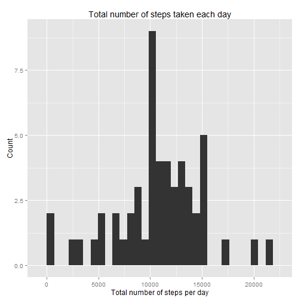
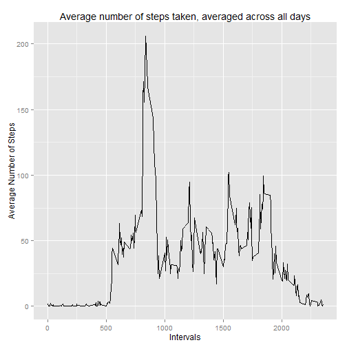
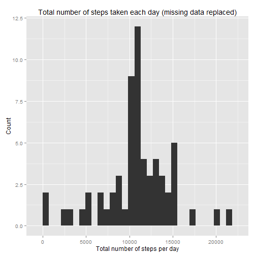
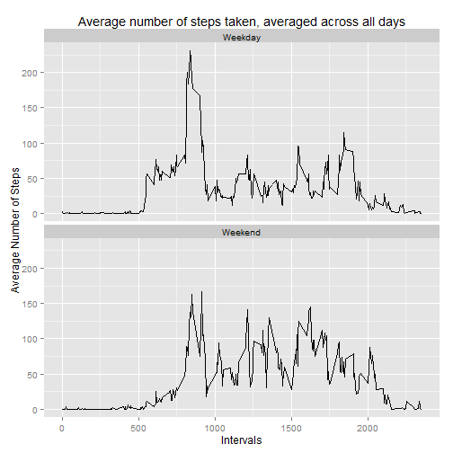

# Introduction

It is now possible to collect a large amount of data about personal movement using activity monitoring devices such as a Fitbit, Nike Fuelband, or Jawbone Up. These type of devices are part of the "quantified self" movement - a group of enthusiasts who take measurements about themselves regularly to improve their health, to find patterns in their behavior, or because they are tech geeks. But these data remain under-utilized both because the raw data are hard to obtain and there is a lack of statistical methods and software for processing and interpreting the data.

This assignment makes use of data from a personal activity monitoring device. This device collects data at 5 minute intervals through out the day. The data consists of two months of data from an anonymous individual collected during the months of October and November, 2012 and include the number of steps taken in 5 minute 
intervals each day.

# Data

The data for this assignment can be downloaded from the course web site:  

* Dataset: [Activity monitoring data](https://d396qusza40orc.cloudfront.net/repdata%2Fdata%2Factivity.zip) [52K]

The variables included in this dataset are:  

* steps: Number of steps taking in a 5-minute interval (missing values are coded as NA)  
* date: The date on which the measurement was taken in YYYY-MM-DD format  
* interval: Identifier for the 5-minute interval in which measurement was taken  

The dataset is stored in a comma-separated-value (CSV) file and there are a total of 17,568 observations in this dataset.

# Environment Settings


```r
# Set up environment
options(warn=-1)
library(knitr)
library(ggplot2) 
library(dplyr)
```

```
## 
## Attaching package: 'dplyr'
## 
## The following object is masked from 'package:stats':
## 
##     filter
## 
## The following objects are masked from 'package:base':
## 
##     intersect, setdiff, setequal, union
```

```r
options(warn=0)
opts_chunk$set(echo = TRUE, results = 'hold')
options(scipen = 1)
setwd("C:/Users/daniel.ibanez/Google Drive/Coursera/Reproducible/Peer Assesment 1/RepData_PeerAssessment1")
```


# Loading and preprocessing the data

1. Load the data (i.e. read.csv())  

2. Process/transform the data (if necessary) into a format suitable for your analysis  


```r
#Load Data
data = read.csv("activity.csv")
#Turn date into POSIX date field
data$date = as.Date(data$date,"%Y-%m-%d")
```


# What is mean total number of steps taken per day?

1. Calculate the total number of steps taken per day 


```r
# Filter data for only valid 
valid_data = filter(data, !is.na(steps))
# What is mean total number of steps taken per day?
valid_data = group_by(valid_data, date)
dailysteps_data = summarise(valid_data, total_steps = sum(steps))
head(dailysteps_data)
```

```
## Source: local data frame [6 x 2]
## 
##         date total_steps
## 1 2012-10-02         126
## 2 2012-10-03       11352
## 3 2012-10-04       12116
## 4 2012-10-05       13294
## 5 2012-10-06       15420
## 6 2012-10-07       11015
```

2. If you do not understand the difference between a histogram and a barplot, research the difference between them. Make a histogram of the total number of steps taken each day  


```r
# Plot Histogram
outplot = ggplot(dailysteps_data, aes(x=total_steps)) + 
        geom_histogram() +
        xlab("Total number of steps per day") +
        ylab("Count") +
        theme_grey() +
        ggtitle("Total number of steps taken each day")
print(outplot)
```

 

3. Calculate and report the mean and median of the total number of steps taken per day  


```r
dailysteps_mean = mean(dailysteps_data$"total_steps")
cat("Mean of the total number of steps:",
    dailysteps_mean, "\n")
dailysteps_median = median(dailysteps_data$"total_steps")
cat("Median of the total number of steps:", 
    dailysteps_median, "\n")
```

```
## Mean of the total number of steps: 10766.19 
## Median of the total number of steps: 10765
```


# What is the average daily activity pattern?

1. Make a time series plot (i.e. type = "l") of the 5-minute interval (x-axis) and the average number of steps taken, averaged across all days (y-axis)  


```r
#What is the average daily activity pattern?
valid_data = group_by(valid_data, interval)
intervalsteps_data = summarise(valid_data, avg_steps = mean(steps))
# Plot Time Series
outplot = ggplot(intervalsteps_data, aes(x=interval, y=avg_steps)) +
        geom_line() +
        xlab("Intervals") +
        ylab("Average Number of Steps") +
        theme_grey() +
        ggtitle("Average number of steps taken, averaged across all days")        
print(outplot)
```

 


2. Which 5-minute interval, on average across all the days in the dataset, contains the maximum number of steps?  


```r
intervalsteps_max =  intervalsteps_data[
        intervalsteps_data$"avg_steps" == max(intervalsteps_data$"avg_steps"),
        ]
cat("Max number of steps in interval", intervalsteps_max$interval, 
    "with ", intervalsteps_max$avg_steps , "steps\n")
```

```
## Max number of steps in interval 835 with  206.1698 steps
```


# Imputing missing values

1. Calculate and report the total number of missing values in the dataset (i.e. the total number of rows with NAs) 


```r
# Missing values in the Dataset
data_NAs = filter(data, is.na(steps))
cat("Numer of rows with missing values in data:", nrow(data_NAs), "\n")
```

```
## Numer of rows with missing values in data: 2304
```

2. Devise a strategy for filling in all of the missing values in the dataset. The strategy does not need to be sophisticated. For example, you could use the mean/median for that day, or the mean for that 5-minute interval, etc.  
3. Create a new dataset that is equal to the original dataset but with the missing data filled in.  


```r
# Means for equivalent intervals was chosen as the strategy to replace data on intervals with NA
# Join original data with mean by interval data
full_data = left_join(data,intervalsteps_data)
```

```
## Joining by: "interval"
```

```r
# Replace NA with mean for the interval from valid data
full_data = mutate(full_data, steps=ifelse(is.na(steps), avg_steps, steps))
```

4. Make a histogram of the total number of steps taken each day and Calculate and report the mean and median total number of steps taken per day. Do these values differ from the estimates from the first part of the assignment? What is the impact of imputing missing data on the estimates of the total daily number of steps?  


```r
# Calculate total number of steps for full data
full_data = group_by(full_data, date)
dailystepsfull_data = summarise(full_data, total_steps = sum(steps))
# Plot
outplot = ggplot(dailystepsfull_data, aes(x=total_steps)) + 
        geom_histogram() +
        xlab("Total number of steps per day") +
        ylab("Count") +
        theme_grey() +
        ggtitle("Total number of steps taken each day (missing data replaced)")
print(outplot)
```

 


```r
dailystepsfull_mean = mean(dailystepsfull_data$"total_steps")
cat("Mean of the total number of steps after imputing missing data:", 
    dailystepsfull_mean, "\n")
dailystepsfull_median = median(dailystepsfull_data$"total_steps")
cat("Median of the total number of steps after imputing missing data:", 
    dailystepsfull_median, "\n")
```

```
## Mean of the total number of steps after imputing missing data: 10766.19 
## Median of the total number of steps after imputing missing data: 10766.19
```

Due to the strategy chosen to replace NAs, the mean did not vary, but the median varied minimally.  


```r
cat("Mean with missing data", dailysteps_mean, ", 
    with missing data replaced:", dailystepsfull_mean, ".\n")
cat("Median with missing data", dailysteps_median, ", 
    with missing data replaced:", dailystepsfull_median, ".\n")
```

```
## Mean with missing data 10766.19 , 
##     with missing data replaced: 10766.19 .
## Median with missing data 10765 , 
##     with missing data replaced: 10766.19 .
```

# Are there differences in activity patterns between weekdays and weekends?

1. Create a new factor variable in the dataset with two levels - "weekday" and "weekend" indicating whether a given date is a weekday or weekend day.


```r
# Create new variable indicating type of day
full_data = mutate(
        full_data, days=
                ifelse(weekdays(date)=="Saturday" 
                       | weekdays(date)=="Sunday"
                       , "Weekend", "Weekday")
                )
head(full_data)
```

```
## Source: local data frame [6 x 5]
## Groups: date
## 
##       steps       date interval avg_steps    days
## 1 1.7169811 2012-10-01        0 1.7169811 Weekday
## 2 0.3396226 2012-10-01        5 0.3396226 Weekday
## 3 0.1320755 2012-10-01       10 0.1320755 Weekday
## 4 0.1509434 2012-10-01       15 0.1509434 Weekday
## 5 0.0754717 2012-10-01       20 0.0754717 Weekday
## 6 2.0943396 2012-10-01       25 2.0943396 Weekday
```

2. Make a panel plot containing a time series plot (i.e. type = "l") of the 5-minute interval (x-axis) and the average number of steps taken, averaged across all weekday days or weekend days (y-axis).  


```r
# Calculate the average steos by interval for both tpes of days (weekend/weekday)
full_data = group_by(full_data, days, interval)
intervalstepsdays_data = summarise(full_data, avg_steps = mean(steps))
# Plot
outplot = ggplot(intervalstepsdays_data, aes(x=interval, y=avg_steps)) + 
        geom_line() + 
        xlab("Intervals") +
        ylab("Average Number of Steps") +
        theme_grey() +
        ggtitle("Average number of steps taken, averaged across all days") +        
        facet_wrap(~days, ncol=1)
print(outplot)
```

 
